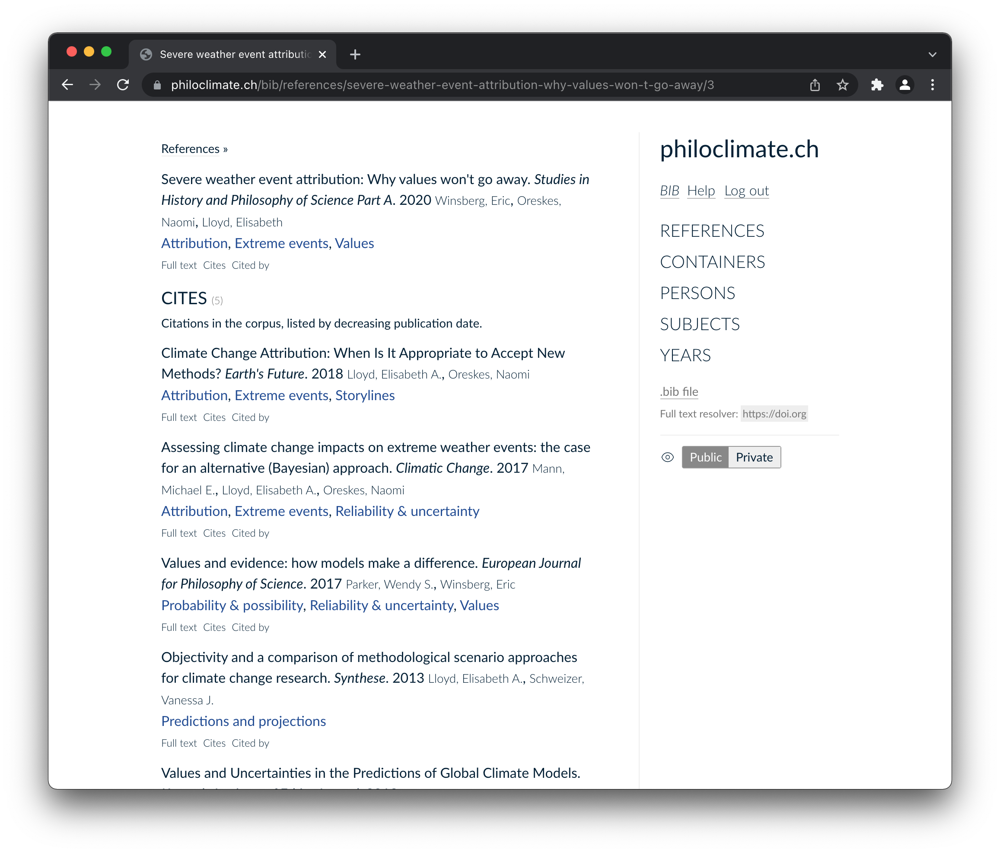
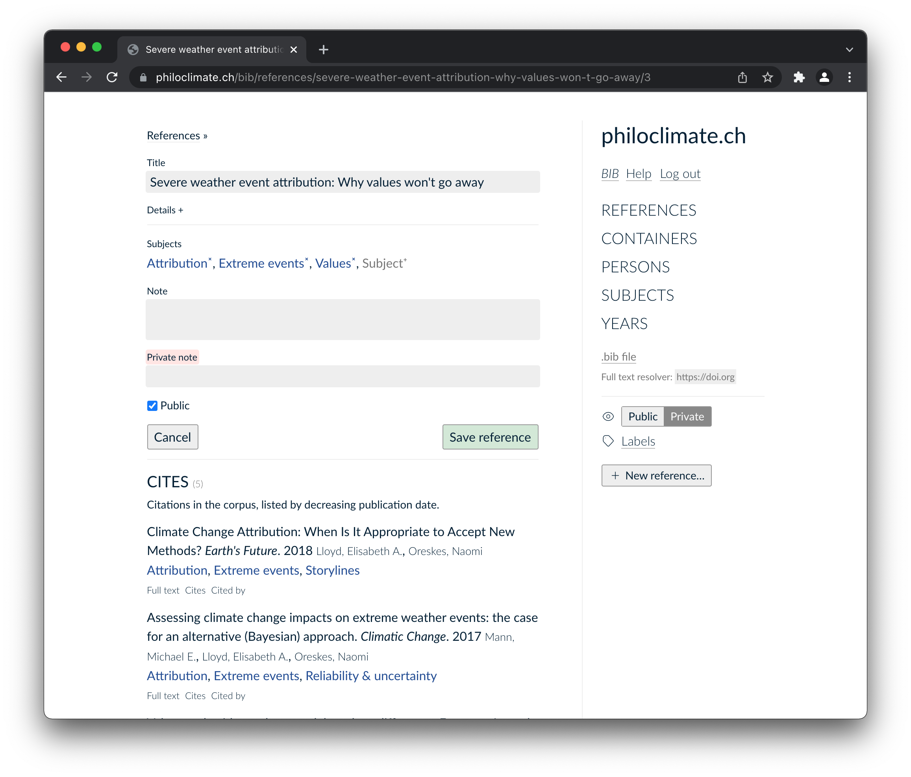
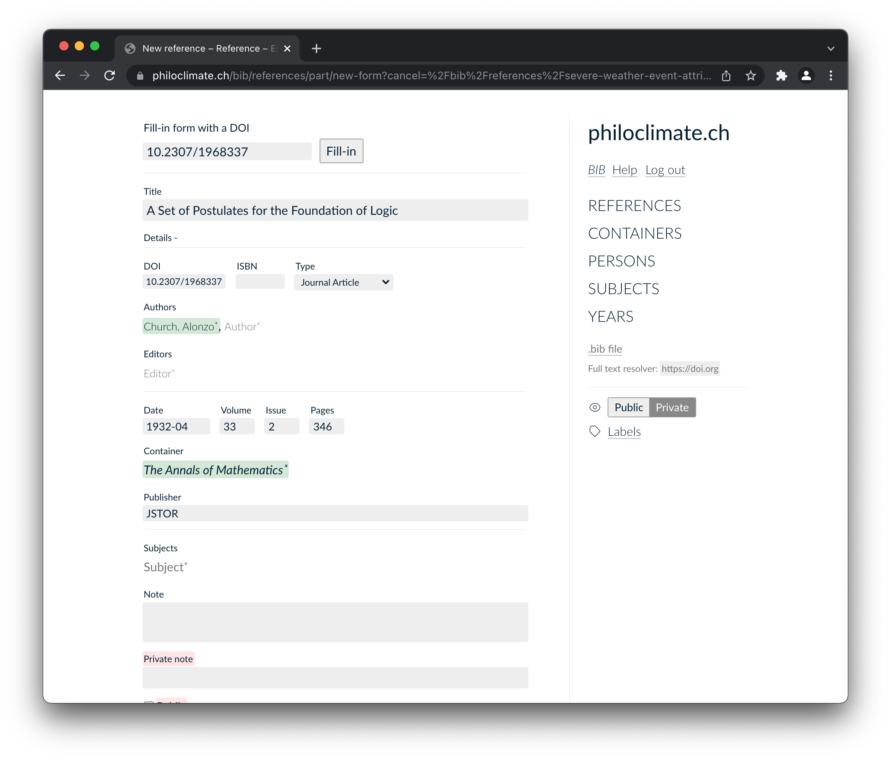
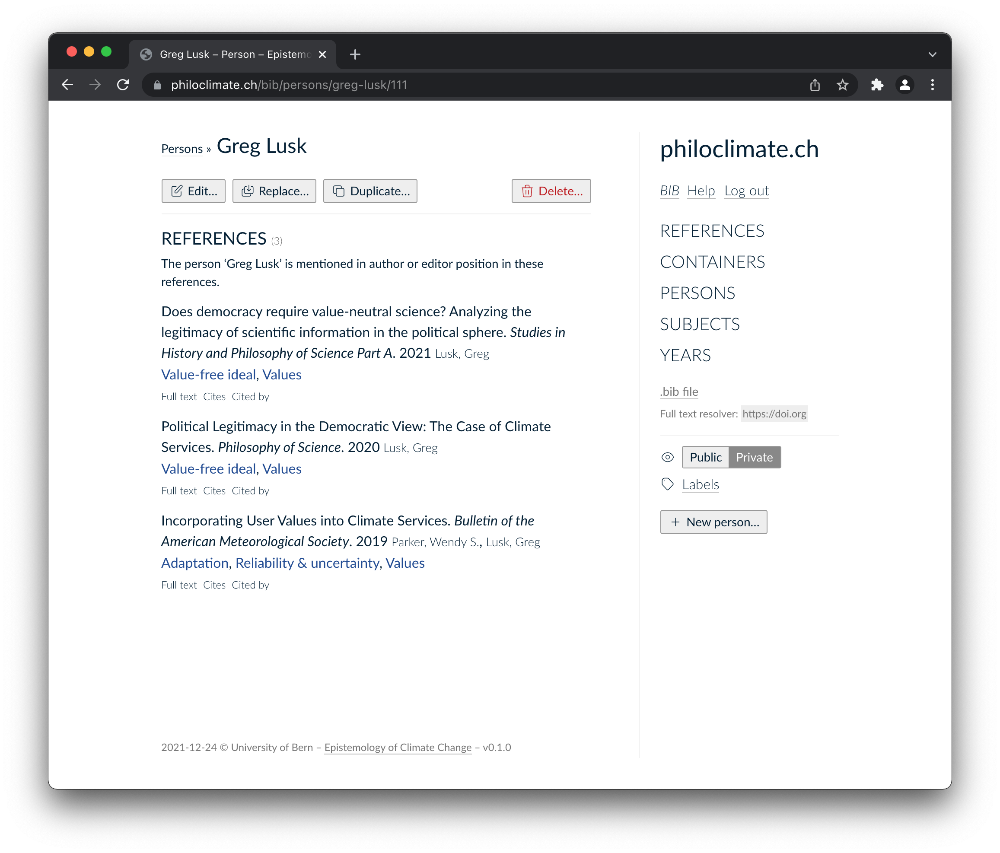
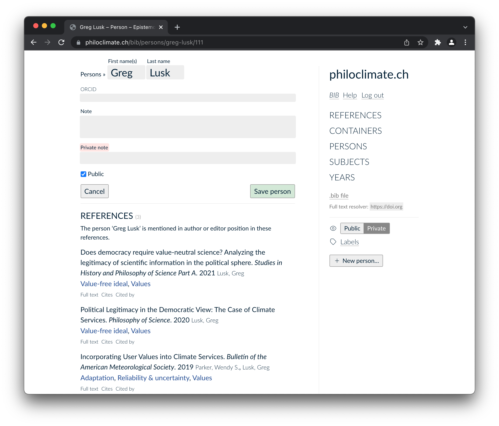

Hyperbib — Publish annotated bibliographies
===========================================

Hyperbib is a web application to edit and publish annotated
bibliographies.

See a few [screenshots](#screenshots).

Hyperbib is distributed under the ISC license.

# Install 

**Note** hyperbib is currently in development for the
[philoclimate][philoclimate] project. It is not being distributed and
a few things need to be generalized to make it usable for other
projects.

```
opam install . --deps-only 
b0 -- hyperbib --help 
```

# Documentation 

See [manual](doc/manual.md).

# Public users

* Bibliography on the 
  [Epistemology of Climate change](https://philoclimate.ch/bib/)

# Acknowledgements 

This project is funded by the [Swiss National Science Foundation][snsf]
project PP00P1 170460 “[The Epistemology of Climate
Change][philoclimate].”

[snsf]: https://www.snf.ch/en
[philoclimate]: https://philoclimate.ch

# Screenshots 

From a logged-in bibliography editor perspective. 

Switching from public to private view:




Editing a reference to annotate it: 



Adding a new reference by DOI: 



Author private and edit view: 




